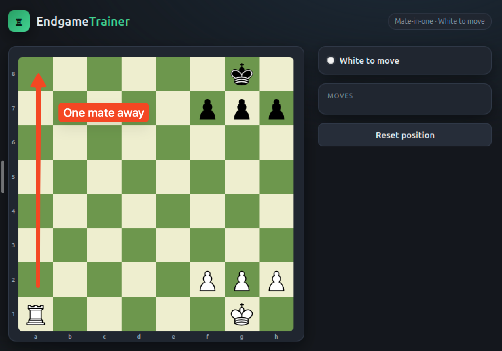
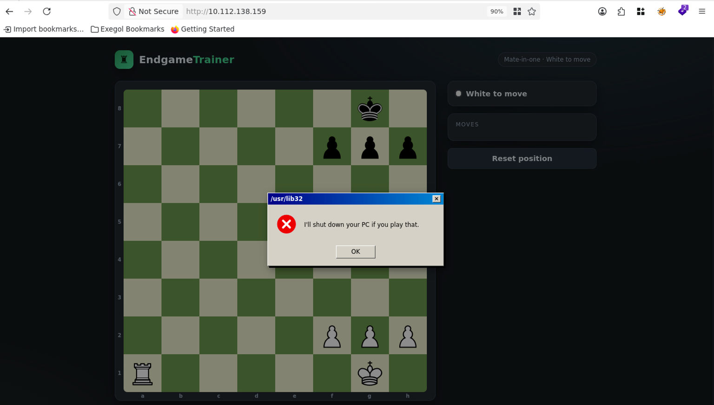
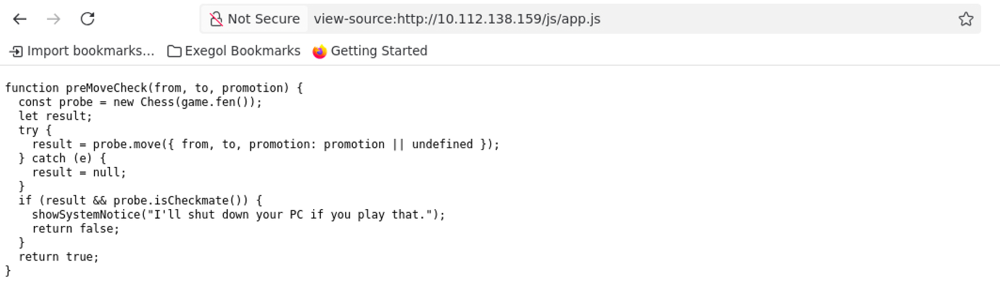
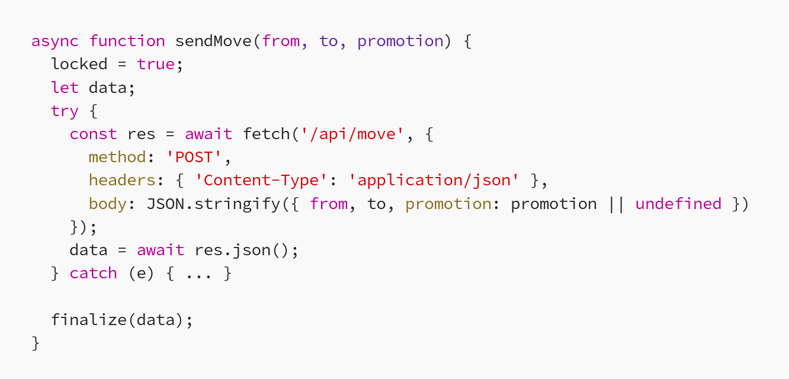
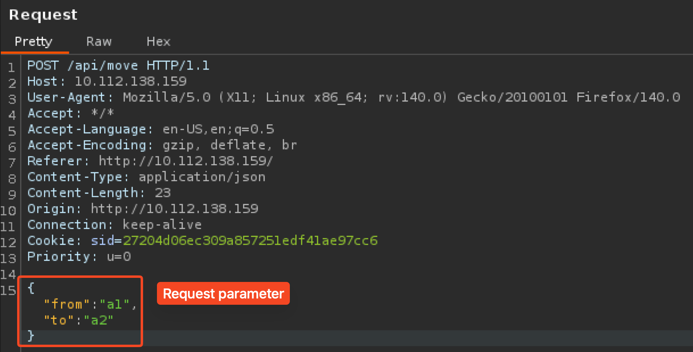
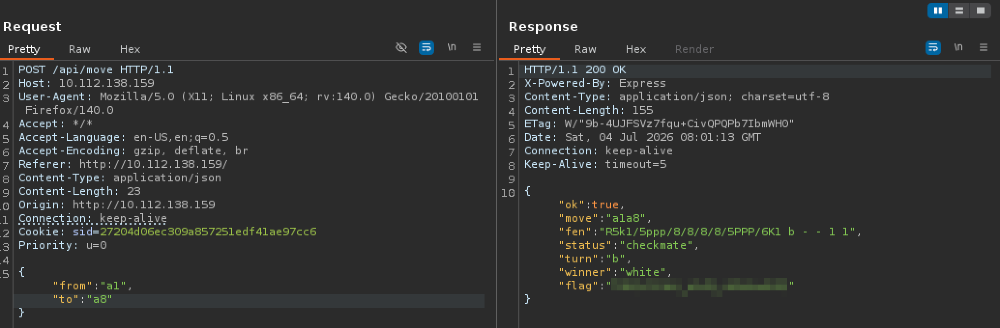

# Fools Mate Room

## Writeups

After connecting to your machine, open the Web App. At the very first, we are presented a chess board like the image below. It's the white turn to move. It's clearly visible that we are one mate away by moving the rook from `a1` to `a8`. 

But when we try to move the rook to `a8`, the system says _I'll shut down your PC if you play that_. But if you're trying to move the other pieces, it is legally fine.

> So, there must be some sort of validation behind this, right? :D

Of course there is. To understand the mechanism behind this chess game, let's audit the code that controlling the game by inspecting the source using developer tools.

Scrolling down through the bottom, we can find the JS script module. Click to navigate to the source code. Or type `view-source:http://YOUR_ATTACK_MACHINE_IP_ADDRESS/js/app.js` in the URL field. Understand the JS code helps you to understand how this is working in the nutshell.

Upon reviewing the code, I found an interesting code that looks exactly like the "win" is trigger.
Remember what it says when we try to move the rook to `a8`?
Yes this is the code that control the win mechanism.

Scroll again to the bottom, you'll find another interesting code. This code perform a `POST` actions. Here's what the code:

This game call a back-end resource to move the chess pieces according to the parameter. You can use `cURL` or any other interceptor tools. But for this, I will use [Burp Suite](https://portswigger.net/burp) to intercept the request.

### Performing the Exploitation

1. Fire up Burp Suite (community edition just fine), then turn on the foxy proxy.
2. Perform any legal moves. For example, move the rook to `a7`. This is for intercepting the request so we can modify the request in Burp.
3. Notice that the request took `from` and `to` parameter to move the piece. 
4. To win the game, you must move the rook to `a8` _(hence the reason why this challenge is one mate away)_. Change the value of `to` parameter to `a8`.
5. Forward the request, and then you'll get the flag. 
